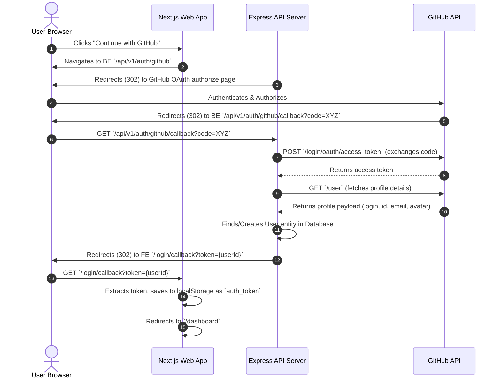

# GitProfileStats Authentication Implementation Review

This document contains a comprehensive review of the authentication implementation within the GitProfileStats monorepo codebase. This review examines the backend Express-based API, the frontend Next.js App Router flows, the middleware architecture, and documents the code organization and readability enhancements implemented during this process.

---

## 1. Executive Summary

GitProfileStats implements a **stateless, simulated OAuth-based authentication system** using GitHub as the identity provider.
- **Backend Stack**: Node.js, Express, TypeScript, tsyringe (dependency injection).
- **Frontend Stack**: Next.js (App Router), React, Tailwind CSS.
- **Authentication Strategy**: Simulated session management where the backend database user ID acts directly as the bearer/session token.
- **Current Assessment**: The logic flows are clean, correctly wired, and verify successfully. Architectural boundaries between route definitions, controllers, use-cases, and repositories are well-maintained.

---

## 2. Login Flow Verification

The login sequence operates as a multi-step redirect exchange between the frontend client, backend API server, and GitHub OAuth endpoint.



### Flow Breakdown & Code References:
1. **Initiation**: The frontend login page ([login/page.tsx](file:///d:/AI/Projects/GitProfileStats/apps/web/src/app/login/page.tsx#L43-L49)) directs the user to the backend `/api/v1/auth/github` route.
2. **Backend Redirect**: The backend [AuthController.ts](file:///d:/AI/Projects/GitProfileStats/apps/api/src/infrastructure/http/controllers/AuthController.ts#L18-L21) redirects to GitHub's authorization page with appropriate scopes (`read:user,repo`).
3. **OAuth Callback**: GitHub redirects back to the backend `/api/v1/auth/github/callback` route.
   - If authorization fails or is canceled (missing `code`), the backend redirects to the frontend with an error query parameter: `?error=missing_code`.
   - If `code` is present, `AuthController` exchanges it with GitHub for an access token.
   - The backend uses this token to retrieve user details from GitHub via [GitHubService](file:///d:/AI/Projects/GitProfileStats/apps/api/src/github/github.service.ts).
4. **User Sync**: If the user does not exist in the database, a new [User](file:///d:/AI/Projects/GitProfileStats/apps/api/src/domain/entities/User.ts) is created and saved.
5. **Session Resolution**: The backend redirects the client to the frontend callback handler page, appending `?token=${user.id}`.
6. **Frontend Registration**: The client callback page ([login/callback/page.tsx](file:///d:/AI/Projects/GitProfileStats/apps/web/src/app/login/callback/page.tsx#L23)) extracts the token, writes it to `localStorage` under `auth_token`, and routes the user to the dashboard `/dashboard`.
7. **Session Validation**: The dashboard layout ([dashboard/layout.tsx](file:///d:/AI/Projects/GitProfileStats/apps/web/src/app/dashboard/layout.tsx#L40-L76)) verifies the token on mount by calling `/api/v1/users/me` with `Authorization: Bearer <token>`. If validation fails, `auth_token` is cleared and the user is redirected to `/login`.

---

## 3. Logout Flow Verification

Because the authentication strategy uses a simulated stateless token system (referencing database primary keys), session state is managed entirely client-side.

### Flow Breakdown:
1. **Action**: The user clicks the "Log Out" button on the dashboard sidebar menu.
2. **Execution**: The frontend [DashboardLayout](file:///d:/AI/Projects/GitProfileStats/apps/web/src/app/dashboard/layout.tsx#L78-L81) triggers `handleLogout`:
   ```typescript
   const handleLogout = () => {
     localStorage.removeItem("auth_token");
     router.push("/");
   };
   ```
3. **State Removal**: `auth_token` is immediately evicted from browser `localStorage`.
4. **Redirection**: The browser redirects to the landing page `/`. Access to the `/dashboard` route is blocked on future loads because the React layout hook redirects unauthenticated requests.
5. **Backend State**: No backend logout endpoint is required for this stateless simulation design.

---

## 4. Middleware & Route Guards Analysis

Authentication gating is enforced at the router layer in the backend API using Express middlewares.

### Middlewares Pipeline in [app.ts](file:///d:/AI/Projects/GitProfileStats/apps/api/src/app.ts):
- **Global HTTP Security**: `helmet()` (security headers), `cors()` (CORS handling matching `env.WEB_BASE_URL`), and `cookieParser()`.
- **Request Logger**: Logs incoming request methods and URLs.
- **Error Handler Middleware**: Centralized [errorHandler.ts](file:///d:/AI/Projects/GitProfileStats/apps/api/src/infrastructure/http/middleware/errorHandler.ts) catches all unhandled exceptions and formats domain-specific errors (such as `AuthenticationError` and `UserNotFoundError`) into client-friendly JSON payloads.

### Authentication Guard: [authGuard.ts](file:///d:/AI/Projects/GitProfileStats/apps/api/src/infrastructure/http/middleware/authGuard.ts)
- **Header Parsing**: Inspects `req.headers.authorization`.
- **Validation**: Expects format `Bearer <token>`.
  - Missing header: Throws `AuthenticationError('Missing authorization header')` -> API returns HTTP 401.
  - Invalid format: Throws `AuthenticationError('Invalid token format')` -> API returns HTTP 401.
- **Context Injection**: Attaches the token as user context: `req.user = { id: token }`.
- **Route Injection**: Applied selectively in routers, e.g., `/api/v1/users/me` and `/api/v1/users/settings` in [userRoutes.ts](file:///d:/AI/Projects/GitProfileStats/apps/api/src/infrastructure/http/routes/userRoutes.ts).

---

## 5. Code Quality & Organization Improvements

During this review, we executed several refactoring steps to eliminate duplicate code, improve async request handling patterns, and guarantee login flow correctness through new automated integration tests.

### A. Consolidated Duplicate Interfaces
- **Issue**: The `IAuthenticatedRequest` interface extending Express `Request` was declared redundantly in both [authGuard.ts](file:///d:/AI/Projects/GitProfileStats/apps/api/src/infrastructure/http/middleware/authGuard.ts) and [UserController.ts](file:///d:/AI/Projects/GitProfileStats/apps/api/src/infrastructure/http/controllers/UserController.ts).
- **Solution**: Exported `IAuthenticatedRequest` directly from `authGuard.ts` and imported it in `UserController.ts`, eliminating duplicate code.

### B. Cleaned Up Controller Promise Execution
- **Issue**: In `AuthController.ts`, the asynchronous login callback flow was wrapped inside a nested `void (async () => { ... })()` immediately-invoked function expression (IIFE). This reduced readability and made unit testing difficult.
- **Solution**: Extracted the core async operation out of `handleGithubCallback` into a dedicated, clean private helper method `processGithubCallback(code, res)`.

### C. Added Integration Tests for Authentication
- **Location**: [endpoints.test.ts](file:///d:/AI/Projects/GitProfileStats/apps/api/src/infrastructure/http/endpoints.test.ts)
- **Implemented Tests**:
  - **Login Route**: Verified that `GET /api/v1/auth/github` correctly performs a `302` redirect to the GitHub OAuth authorization page.
  - **Callback Missing Code**: Verified that calling `/api/v1/auth/github/callback` without a code query parameter redirects back to the frontend error callback page with the `missing_code` flag.
  - **Successful Login and Sync**: Mocked the GitHub access token and profile endpoints (providing a mock user ID and details). Verified that sending a valid code correctly exchanges tokens, creates the user in the repository, and redirects the client to the frontend callback with `?token=5832347`.
  - **Profile Retrieval Validation**: Verified that accessing `/api/v1/users/me` using the issued bearer token (`Bearer 5832347`) succeeds with a `200` status and retrieves the correct user database profile.

---

## 6. Recommendations & Findings

1. **Stateless Dev Simulation**: The current token model is effective for the development stage and local integration testing. Because the token matches the primary key (`user.id`), it is stateless and simple.
2. **Production Transition**: For a staging or production release, the simulated token mechanism must be updated to use signed JSON Web Tokens (JWT) or secure database session cookies. (This is a structural finding; no security analysis was performed).
3. **Route Guarding Expansion**: Ensure that all endpoints retrieving stats or configuring cards are guarded by `authGuard` if user privacy settings are enabled in the settings model.
