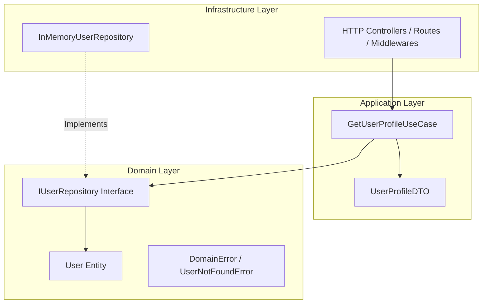

# GitProfileStats Backend Analysis Report

This document contains a comprehensive architectural and code analysis of the **GitProfileStats** backend codebase. 

---

## 1. Current Architecture

The project is configured as a TypeScript **monorepo** managed by **Turborepo** (`turbo.json`) and **pnpm workspaces** (`pnpm-workspace.yaml`).

The only functional workspace currently present is the Express.js API backend under `apps/api/`. Its internal codebase is structured following **Clean Architecture** and **Domain-Driven Design (DDD)** principles to enforce decoupling and maintainability:



### Flow of Dependencies
- **Domain Layer (`src/domain`)**: The core of the business logic. It does not depend on any outer layers, frameworks, or database drivers. It defines rich entities (`User`), domain exceptions (`DomainError`), and interfaces (`IUserRepository`).
- **Application Layer (`src/application`)**: Orchestrates business logic by executing Use Cases. It interacts with the Domain layer via interfaces, remaining agnostic of database frameworks or transport layers.
- **Infrastructure Layer (`src/infrastructure`)**: Implements technical details. This is where controllers handle HTTP requests, routing triggers, middlewares validate requests, and concrete repositories (`InMemoryUserRepository`) persist data.
- **Config Layer (`src/config`)**: Configures application bootstrap requirements, including Environment Variable validation (`env.ts`), logger configurations (`logger.ts`), and the Dependency Injection (DI) container (`container.ts`).
- **Dependency Injection**: Uses `tsyringe` to register concrete repository adapters to token strings (e.g., mapping `InMemoryUserRepository` to `'IUserRepository'`), achieving Inversion of Control (IoC).

---

## 2. Folder Structure and Purpose

Below is a breakdown of every directory in the project workspace and its specific responsibility:

### Root Workspace Directories
| Path | Purpose |
|:---|:---|
| [apps/](file:///d:/AI/Projects/GitProfileStats/apps) | Contains the individual application workspaces of the monorepo. |
| [apps/api/](file:///d:/AI/Projects/GitProfileStats/apps/api) | Workspace directory for the Express.js API backend application. |

### API Backend Directories (`apps/api/src`)
| Path | Purpose |
|:---|:---|
| [src/application/](file:///d:/AI/Projects/GitProfileStats/apps/api/src/application) | Application layer containing logic to orchestrate domain flows. |
| [src/application/dtos/](file:///d:/AI/Projects/GitProfileStats/apps/api/src/application/dtos) | Data Transfer Objects that define the structure of data sent across boundaries. |
| [src/application/use-cases/](file:///d:/AI/Projects/GitProfileStats/apps/api/src/application/use-cases) | Specific use case files representing unique application workflows. |
| [src/application/use-cases/user/](file:///d:/AI/Projects/GitProfileStats/apps/api/src/application/use-cases/user) | Use cases centered around user profiles and information. |
| [src/config/](file:///d:/AI/Projects/GitProfileStats/apps/api/src/config) | Application bootstraps, DI registration, env schema schemas, and logs. |
| [src/domain/](file:///d:/AI/Projects/GitProfileStats/apps/api/src/domain) | Domain layer encapsulating core enterprise business rules and concepts. |
| [src/domain/entities/](file:///d:/AI/Projects/GitProfileStats/apps/api/src/domain/entities) | Rich business entities with state, identity, and business behaviors. |
| [src/domain/errors/](file:///d:/AI/Projects/GitProfileStats/apps/api/src/domain/errors) | Custom domain-specific errors mapping logic failures to clean error codes. |
| [src/domain/interfaces/](file:///d:/AI/Projects/GitProfileStats/apps/api/src/domain/interfaces) | Contracts/abstractions for repository queries and third-party integrations. |
| [src/infrastructure/](file:///d:/AI/Projects/GitProfileStats/apps/api/src/infrastructure) | External tools, frameworks, and concrete database wrappers. |
| [src/infrastructure/http/](file:///d:/AI/Projects/GitProfileStats/apps/api/src/infrastructure/http) | Express.js Web layer configurations (controllers, routes, middlewares). |
| [src/infrastructure/http/controllers/](file:///d:/AI/Projects/GitProfileStats/apps/api/src/infrastructure/http/controllers) | HTTP entry points mapping API requests to corresponding use-case inputs. |
| [src/infrastructure/http/middleware/](file:///d:/AI/Projects/GitProfileStats/apps/api/src/infrastructure/http/middleware) | Custom express middleware logic (e.g. auth check, centralized error handler). |
| [src/infrastructure/http/routes/](file:///d:/AI/Projects/GitProfileStats/apps/api/src/infrastructure/http/routes) | Express routing definitions. |
| [src/infrastructure/persistence/](file:///d:/AI/Projects/GitProfileStats/apps/api/src/infrastructure/persistence) | Database query generation and data storage configurations. |
| [src/infrastructure/persistence/repositories/](file:///d:/AI/Projects/GitProfileStats/apps/api/src/infrastructure/persistence/repositories) | Concrete implementation adapters of domain repository contracts. |

---

## 3. Missing Folders and Workspace Components

When comparing the current repository with the architecture documented in the [README.md](file:///d:/AI/Projects/GitProfileStats/README.md) and a production-grade Express/Node backend, several vital components are completely missing.

### Workspace Gaps (Declared in README but Missing)
1. **`apps/web/`**: The Next.js dashboard and card customizer frontend app is missing.
2. **`packages/`**: Monorepo packages intended for sharing configurations and logic are missing:
   - `packages/types/` (Shared models)
   - `packages/shared/` (Shared utilities/constants)
   - `packages/ui/` (SVG templates and card generators)
   - `packages/github-sdk/` (Typed GitHub client)
   - `packages/config/` (Shared lints & tsconfigs)
3. **`infra/`**: Folder for deployment scripts and Terraform modules is missing.
4. **`docker-compose.yml`**: Docker Compose definition file to spin up PostgreSQL and Redis locally is missing.

### Production Backend Gaps (Dependencies Declared but No Implementation)
1. **`apps/api/prisma/`**: No Prisma directory, schema (`schema.prisma`), or migrations folder exist.
2. **`apps/api/src/infrastructure/cache/`**: No cache initialization modules, although `ioredis` is installed as a dependency.
3. **`apps/api/src/infrastructure/queue/`** or **`src/infrastructure/jobs/`**: No folders or files for background queue processing, though `bullmq` is a declared dependency.
4. **`apps/api/src/infrastructure/github/`**: No code integration to call GitHub API REST/GraphQL services.
5. **`apps/api/tests/`** or **`src/**/__tests__/`**: No test directories or test files, despite `vitest` being installed as a test runner.

---

## 4. Code Flaws, Placeholders, TODOs, and Inconsistencies

Several skeleton placeholders, incomplete modules, and technical discrepancies exist inside the codebase:

### Placeholders & Skeleton Implementations
- **Simulated Authentication**:
  In [authGuard.ts](file:///d:/AI/Projects/GitProfileStats/apps/api/src/infrastructure/http/middleware/authGuard.ts#L17-L19), the authentication logic is a dummy simulator:
  ```typescript
  // Simulated authentication: token value is treated as the user ID for development/skeleton testing
  (req as any).user = { id: token };
  ```
  It does not verify JWT sign signatures or fetch a session, leaving the authentication bypassable.
- **Volatile Storage**:
  In [InMemoryUserRepository.ts](file:///d:/AI/Projects/GitProfileStats/apps/api/src/infrastructure/persistence/repositories/InMemoryUserRepository.ts), data is stored in a simple, volatile `Map`. 
  - There are **no routes or methods to create or register a user**.
  - Because it is empty and resets on every server reload, calling `GET /api/v1/users/me` with any simulated authorization header will **always** throw a `UserNotFoundError` and return a 404 response.

### Configuration Gaps
- **Missing `.env` File**:
  Only [.env.example](file:///d:/AI/Projects/GitProfileStats/.env.example) exists in the root workspace. Since `DATABASE_URL` is a required environment variable (validated strictly via Zod in `env.ts`), running `pnpm dev` immediately crashes on startup because no default is provided.

### Unused Dependencies
The following installed modules in `apps/api/package.json` are never imported or used anywhere in the codebase:
- `ioredis` (installed for caching, unused)
- `bullmq` (installed for background queues, unused)
- `jsonwebtoken` (installed for session creation, unused)
- `express-rate-limit` (installed for security/throttling, unused)
- `@prisma/client` and `prisma` (installed for database schema/client, unused)
- `uuid` (installed for generating IDs, unused)
- `http-status-codes` (installed to use HTTP status constants, unused)

### Code & Config Inconsistencies
- **TypeScript Path Mappings**:
  The paths `@domain/*`, `@application/*`, `@infrastructure/*`, and `@config/*` are configured in `apps/api/tsconfig.json` but are completely ignored in the codebase. All imports use standard relative paths (e.g. `../../../domain/...`).
- **Hardcoded HTTP Status Codes**:
  Status codes inside `UserController.ts` (`200`, `401`), `authGuard.ts` (`401`), and `errorHandler.ts` (`500`) are raw integers instead of utilizing constants from the installed `http-status-codes` dependency.
