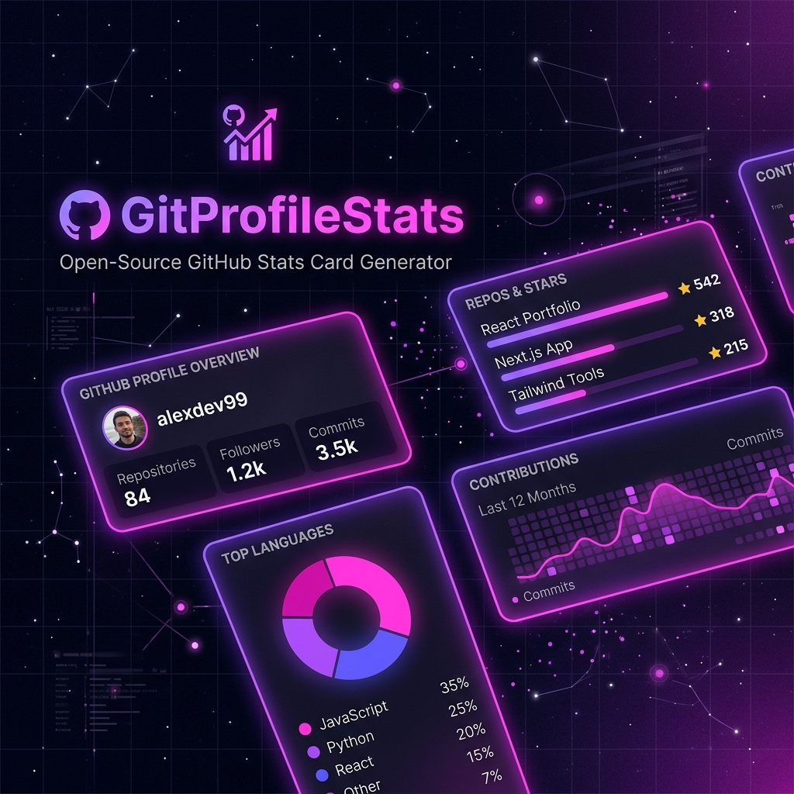

# 

<div align="center">
  <h1>⚡ GitProfileStats</h1>
  <p>Advanced GitHub Analytics & Dynamic Profile Cards</p>
</div>

---

## 📺 Live Demo

Explore the live demo of the dashboard and card customizer:

[🔗 Live Demo – https://gitprofilestats.example.com](https://gitprofilestats.example.com)

---

## ✨ Features

- **Dynamic SVG Profile Cards** – Real‑time stats for profiles, repos, languages, streaks, and more.
- **Rich Customization** – Built‑in themes (Dark, Light, GitHub, Dracula, Nord) plus custom accent, background, border radius, and font style.
- **Private Repository Support** – Secure GitHub OAuth / PAT integration to include private data.
- **Blazing Performance** – Sub‑100 ms response times thanks to intelligent caching.
- **Enterprise‑Grade Security** – AES‑encrypted tokens, Helmet headers, CORS, and OWASP best practices.
- **Comprehensive Metrics** – Profile, Stats, Languages, Streak, Repository cards.
- **Monorepo Architecture** – Turborepo + pnpm workspaces for fast, scalable builds.

---

## 📸 Screenshots

### Web Dashboard & Card Customizer



---

## 💻 Installation & Running Locally

### Prerequisites

- **Node.js** ≥ 20
- **pnpm** ≥ 9

### Steps

```bash
# Clone the repository
git clone https://github.com/your-org/git-profile-stats.git
cd git-profile-stats

# Install dependencies
pnpm install

# Set up environment variables
cp .env.example .env   # Edit .env with your credentials

# Start development servers (web + api)
pnpm dev
```

The dashboard will be available at **http://localhost:3000** and the API at **http://localhost:4000**.

---

## 🔧 Environment Variables

| Variable | Category | Description | Example / Default |
| :--- | :--- | :--- | :--- |
| `NODE_ENV` | Application | Runtime environment | `development` |
| `PORT` | Application | API listening port | `4000` |
| `WEB_BASE_URL` | Application | Frontend base URL | `http://localhost:3000` |
| `LOG_LEVEL` | Logging | Minimum log level (`fatal`, `error`, `warn`, `info`, `debug`, `trace`) | `info` |
| `GITHUB_CLIENT_ID` | GitHub OAuth | OAuth app client ID | `your_github_client_id` |
| `GITHUB_CLIENT_SECRET` | GitHub OAuth | OAuth app client secret | `your_github_client_secret` |
| `GITHUB_CALLBACK_URL` | GitHub OAuth | OAuth redirect URI | `http://localhost:4000/api/v1/auth/github/callback` |
| `GITHUB_TOKEN` | GitHub API | Personal Access Token fallback | `your_github_pat` |
| `NEXT_PUBLIC_API_URL` | Web App | Backend API base URL | `http://localhost:4000` |

---

## 🚀 Deployment Guide

### Backend (Express API)

1. **Choose a host** – Render, Railway, Fly.io, or any VPS.
2. **Build & Start**
   ```bash
   pnpm --filter @gitprofilestats/api build   # compile TypeScript
   pnpm --filter @gitprofilestats/api start   # run the server
   ```
3. **Configure Production Env** – Set all variables from the table above, ensure `NODE_ENV=production`.

### Frontend (Next.js Dashboard)

1. **Deploy to Vercel / Netlify** – Connect the `apps/web` folder.
2. **Build Command**: `pnpm --filter @gitprofilestats/web build`
3. **Environment Variable**: `NEXT_PUBLIC_API_URL` pointing to the live API endpoint.

---

## 📡 API Examples

```bash
# Get combined statistics for a user
curl "https://api.gitprofilestats.com/api/statistics?username=octocat"

# Retrieve top languages
curl "https://api.gitprofilestats.com/api/languages?username=octocat"

# Get contribution streaks
curl "https://api.gitprofilestats.com/api/contributions?username=octocat"
```

For full reference, see the [API Documentation](API.md).

---

## 🎨 Card Examples & Markdown Embeds

### Profile Card

```markdown

```

### Stats Card

```markdown

```

### Languages Card

```markdown

```

### Streak Card

```markdown

```

### Repository Card

```markdown

```

---

## 🎭 Themes

| Theme | Preview |
| :--- | :--- |
| `dark` (default) |  |
| `light` |  |
| `github` |  |
| `dracula` |  |
| `nord` |  |

You can also override any color with the `accent` and `background` query parameters.

---

## ❓ FAQ

**Q:** *Do the cards work on private repositories?*  
**A:** Yes – provide a GitHub Personal Access Token (`GITHUB_TOKEN`) or authenticate via OAuth to include private data.

**Q:** *Can I self‑host the service?*  
**A:** Absolutely. Follow the Deployment Guide above and point `NEXT_PUBLIC_API_URL` to your own backend.

**Q:** *What is the rate limit for the public API?*  
**A:** Unauthenticated requests are limited to 60 req/min per IP. Authenticated requests (OAuth/PAT) enjoy higher limits based on your GitHub plan.

**Q:** *How do I add a custom theme?*  
**A:** Create a CSS file defining the colors and host it, then reference it via the `theme` query parameter or supply custom colors via `accent`/`background`.

---

## 📄 License

This project is licensed under the [MIT License](LICENSE).
